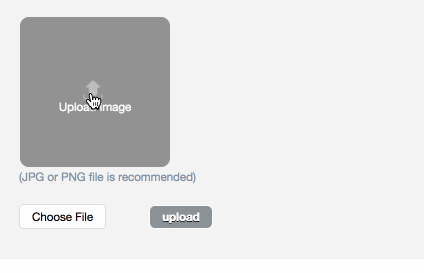
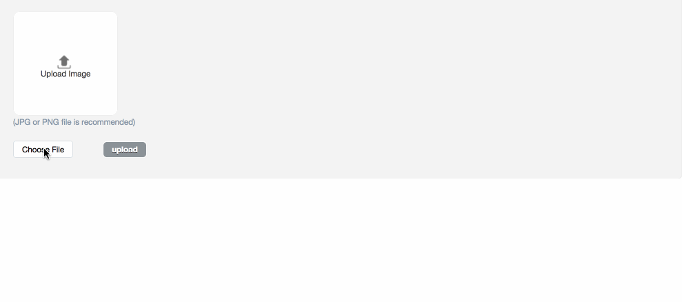

# ActiveAdmin::QiniuInput

ActiveAdmin::QiniuInput provides two inputs for [activeadmin](https://github.com/activeadmin/activeadmin) when we using [qiniu](https://github.com/qiniu/ruby-sdk). They have been used in our company [Beansmile](http://www.beansmile.com/) for several times. And now we open-source them, hoping they can help you.

* qiniu_image



* qiniu_video



## Installation
Add this line to your application's Gemfile:

```ruby
gem 'activeadmin-qiniu_input'
```

And then execute:
```bash
$ bundle
```

Or install it yourself as:
```bash
$ gem install activeadmin-qiniu_input
```

## Usage

* Run the generator:

```bash
$ rails g active_admin:qiniu_input:install
```
Check [here](docs/install_generator.md) to see more information about this generator.

* To use this gem, we need you to implement your API with which we can fetch the [Qiniu meta](https://developer.qiniu.com/kodo/manual/1208/upload-token). With the use of [Qiniu gem](https://github.com/qiniu/ruby-sdk), it should be easy. Please refer to our [test controller code](test/dummy/app/controllers/application_controller.rb).

* Use your api to change `qiniu_meta_url` in `config/initializers/active_admin/qiniu_input.rb`. You also have to set `ActiveAdmin::QiniuInput.domain`.

```ruby
ActiveAdmin::QiniuInput.qiniu_meta_url = "/your_qiniu_meta_url"
ActiveAdmin::QiniuInput.domain = "example.com"
```

* use our inputs in your ActiveAdmin form. Use them like this:

```ruby
form do |f|
  f.inputs do
    f.input :image_url, as: :qiniu_image
    f.input :video_url, as: :qiniu_video
    f.input :audio_url, as: :qiniu_audio
  end
  f.actions
end
```

* we also add `qiniu_image_column`, `qiniu_video_column`, `qiniu_audio_column`, `qiniu_image_row`, `qiniu_video_row` and `qiniu_audio_row` dsl to show images, videos and audio.

```ruby
index do
  column :title
  qiniu_image_column :image_url
  qiniu_video_column :video_url
  qiniu_audio_column :audio_url
  actions
end

show do
  attributes_table do
    row :id
    row :title
    qiniu_image_row :image_url
    qiniu_video_row :video_url
    qiniu_audio_row :audio_url
    row :created_at
    row :updated_at
  end
end
```

## Contributing
Please open an issue or a pull request to Contribute.

## License
The gem is available as open source under the terms of the [MIT License](http://opensource.org/licenses/MIT).
